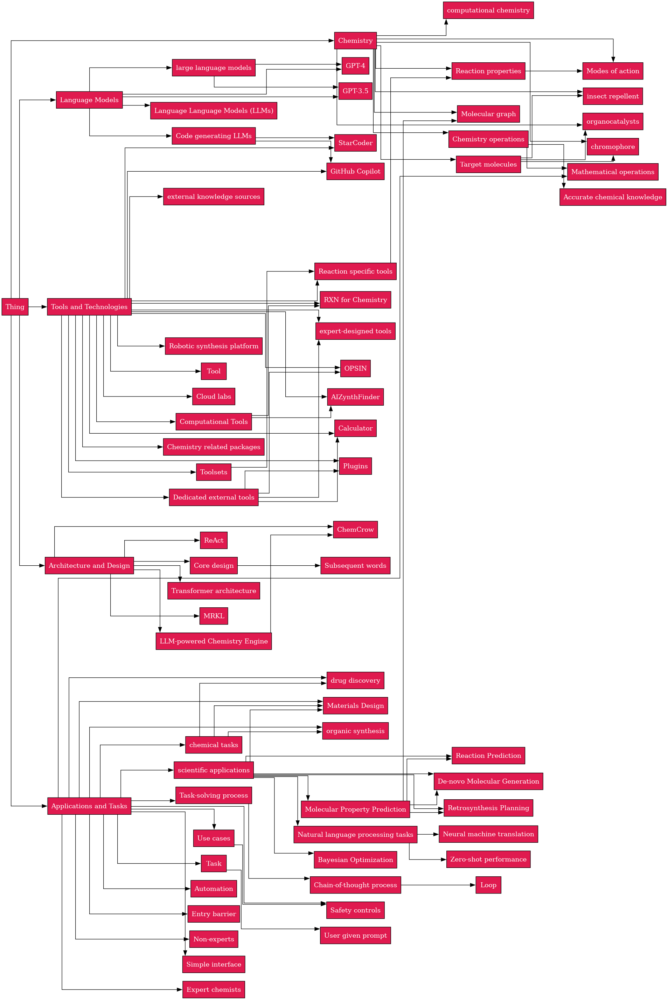

<h1 align="center">
  OntoGen
</h1>
<br>

- [1. Requirements](#1-requirements)
- [2. Installation and Setup](#2-installation-and-setup)
- [3. Usage](#3-usage)
- [4. Example: from paper to taxonomy](#4-example-from-paper-to-taxonomy)

## 1. Requirements

- __Ollama__ : OntoGen is built using Ollama, a tool for running inference on LLMs. See [Ollama](https://ollama.com/) for instalation instructions.

## 2. Installation and Setup

```bash
pip install -r requirements.txt
```

Termo uses trasnformer model ```en_core_web_trf``` from Scapy which should be downloaded beforehand:

```bash
python -m spacy download en_core_web_trf
```

## 3. Usage

### 3.1. Extract plain text from PDF

```bash
python extract_plain_text.py  --recompute  --no-skipping  --model='0.1.0-base'  --batchsize=10  \
<YOUR-PDF-FILE>
```

### 3.2. (Optional) Extract sections from plain text

```bash
python extract_sections.py \
--nougat \
--abstract \
--introduction \
<YOUR-PLAIN-TEXT-FILE>
```

## 3.3. Extract terms, acronyms, definitions, and relationships


```bash
python run_termo.py \
<OLLAMA-MODEL-LABEL> \
<YOUR-TXT-FILE> \
--temperature <TEMPERATURE> \
--max_length_split_terms <MAX-LENGTH-CHUNK> \
--max_length_split_definitions <MAX-LENGTH-CHUNK> \
--max_length_split_relationships <MAX-LENGTH-CHUNK> \
--num_ctx <MAX-CONTEXT-LENGTH>
```

### 3.4. Generate categories


```bash
python generate_categories.py \
<YOUR-MAIN-TOPIC-NAME> \
<TXT-FILE-1> <TXT-FILE-2> ... <TXT-FILE-N> \
--generation-model <OLLAMA-MODEL-LABEL> \
--generation-temperature <TEMPERATURE> \
--generation-num-ctx <MAX-CONTEXT-LENGTH> \
--format-model <OLLAMA-MODEL-LABEL> \
--format-num-ctx <MAX-CONTEXT-LENGTH> \
--synthesis-model <OLLAMA-MODEL-LABEL> \
--synthesis-num-ctx <MAX-CONTEXT-LENGTH> \
--num-retries <NUM-SELF-CONSISTENCY-RETRIES> \
--num-generated-seed <NUM-GENERATED-CATEGORIES>
```

### 3.5. Generate taxonomy


```bash
python generate_taxonomy.py \
<CATEGORIES-SEED-FILE> \
<TXT-FILE-1> <TXT-FILE-2> ... <TXT-FILE-N> \
--num-ctx <MAX-CONTEXT-LENGTH> \
--temperature <TEMPERATURE> \
--model <OLLAMA-MODEL-LABEL>
```


## 4. Example: from paper to taxonomy

```bash
python extract_plain_text.py  --recompute  --no-skipping  --model='0.1.0-base'  --batchsize=10  docs/2304.05376.pdf
```

```bash
python extract_sections.py --nougat  --abstract --introduction docs/2304.05376.processed.nougat.txt
python extract_sections.py --pymupdf  --abstract --introduction docs/2304.05376.processed.pymupdf.txt
```

```bash
python run_termo.py \
llama3.1:70b \
docs/2304.05376.processed.nougat.abstract.txt \
--temperature 0.9 \
--max_length_split_terms 2000 \
--max_length_split_definitions 10000 \
--max_length_split_relationships 10000 \
--num_ctx 9000
```

```bash
python run_termo.py \
llama3.1:70b \
docs/2304.05376.processed.nougat.introduction.txt \
--max_length_split_terms 2000 \
--max_length_split_definitions 10000 \
--max_length_split_relationships 10000 \
--num_ctx 9000 \
--temperature 0.9 
```

```bash
python generate_categories.py \
'Chemistry Augmented Language Models' \
docs/2304.05376.processed.nougat.abstract.txt docs/2304.05376.processed.nougat.introduction.txt \
--generation-model 'llama3.1:8b-instruct-fp16' \
--generation-temperature 0.5 \
--generation-num-ctx 16000 \
--format-model 'llama3.1:70b' \
--format-num-ctx 16000 \
--synthesis-model 'llama3.1:70b' \
--synthesis-num-ctx 16000 \
--num-retries 5 --num-generated-seed 5
```

```bash
python generate_taxonomy.py \
categories/Chemistry\ Augmented\ Language\ Models_categories_seed.0.txt \
docs/2304.05376.processed.nougat.abstract.txt \
docs/2304.05376.processed.nougat.introduction.txt \
--num-ctx 32000 \
--temperature 0.1 \ 
--model 'llama3.1:70b' \
```

To visualize the generated taxonomy, see the ```visualize_taxonomy.ipynb``` notebook.

