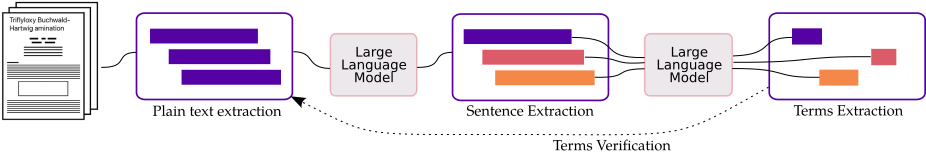

# TERMO: Term Extraction from Scientific Literature

TERMO is a tool for in-context extraction of _terms_, _acronyms_, _definitions_, and _relationships_ from scientific literature using Large Language Models (LLMs).

<p align="center">

</p>

## Table of Contents

- [1. Requirements](#1-requirements)
- [2. Installation and Setup](#2-installation-and-setup)
- [3. Usage](#3-usage)
- [4. Example](#4-example)

## 1. Requirements

- __Ollama__ : TERMO uses Ollama to run inference on LLMs. See [Ollama](https://ollama.com/) for instalation instructions.

## 2. Installation and Setup

```bash
pip install -r requirements.txt
```

Termo uses trasnformer model ```en_core_web_trf``` from Scapy which should be downloaded beforehand:

```bash
python -m spacy download en_core_web_trf
```

If instead of Ollama you want to use TERMO with [Anthropic API](https://docs.anthropic.com/en/api/getting-started), you need to setup first your Anthropic API key:

```bash
export ANTHROPIC_API_KEY=<YOUR_API_KEY>
```

## 3. Usage

### 3.1. Term Extraction

```python
my_text = "The Calvin cycle, light-independent reactions, bio synthetic phase..."

termo = Termo(my_text)
terms = termo.extract_terms(model="llama3.1:70b")
```

### 3.2. Acronym Extraction

```python
termo['terms'] = terms  # terms extracted in the first step
acronyms = termo.extract_acronyms(model="llama3.1:70b")
```

### 3.3. Definition Extraction

```python
termo['terms'] = terms  # terms extracted in the first step
definitions = termo.extract_definitions(model="llama3.1:70b")
```

### 3.4. Relationship Extraction

```python
termo['terms'] = terms  # terms extracted in the first step
relationships = termo.extract_relationships(model="llama3.1:70b")
```

## 4. Example

You can find an example of how to use TERMO in the following [notebook](example.ipynb).

<a target="_blank" href="https://colab.research.google.com/github/schwallergroup/ontorag/blob/main/src/OntoGen/termo/example.ipynb">
  
</a>


